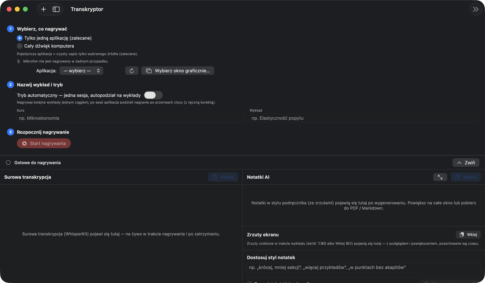
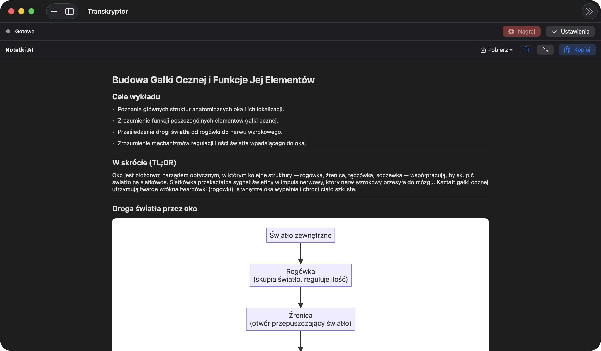
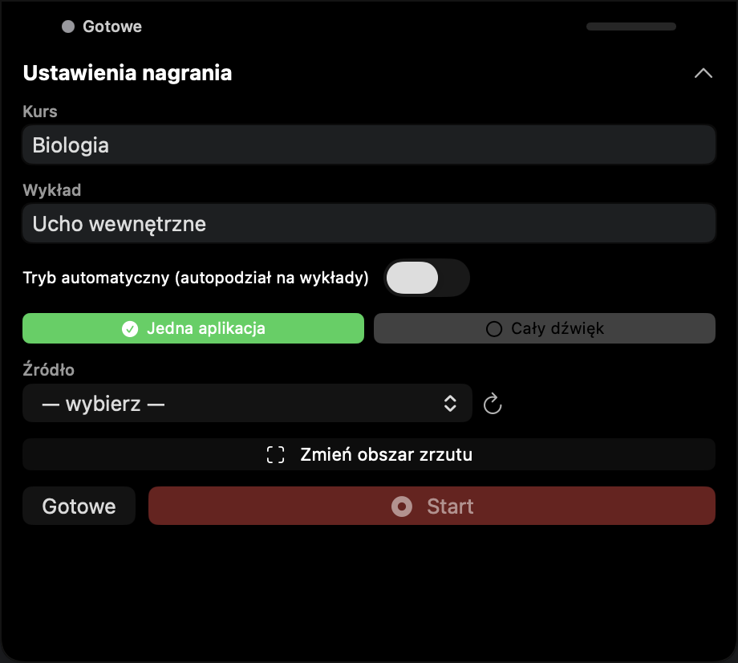
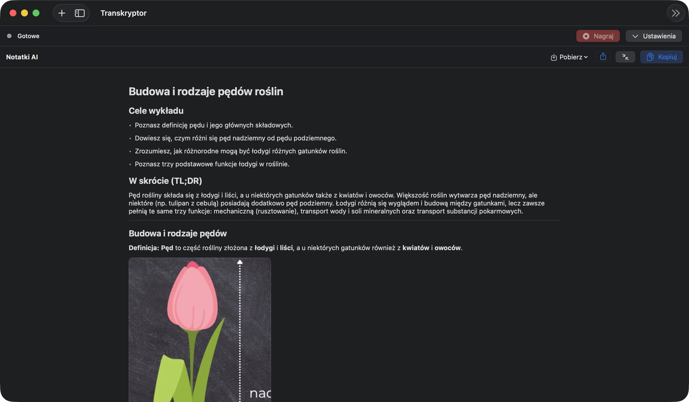

# Transkryptor — On-device lecture transcription → AI study notes (macOS)

> A native macOS app that records the audio coming **out of your computer** during an online lecture, transcribes it **on-device** in Polish, and turns it into clean, textbook-style study notes — diagrams, formulas and screenshots included.

> ✅ **Source code is public.** This is a personal project; the full implementation is in this repository.

---

## Overview

Transkryptor is a native **SwiftUI / macOS 14+** app for students. You point it at a lecture playing in any app (Safari, Zoom, a video player…), it captures only the **outgoing** audio via ScreenCaptureKit, transcribes Polish speech **locally** with WhisperKit (CoreML / Apple Neural Engine), and sends the transcript to the Claude API to produce structured notes.

The focus of the project — and of this write-up — is **systems engineering on Apple platforms**: capturing system audio without third-party drivers, keeping multi-hour on-device ML within an 8 GB RAM budget, and making the AI output durable and export-clean.

---

## Notable Features

- 🎙️ **Captures outgoing computer audio, never the microphone** — single app/window or the whole system, via ScreenCaptureKit. No BlackHole, no virtual audio device, no Python.
- 🧠 **On-device Polish transcription** (WhisperKit / CoreML) — defaults to a compact multilingual **turbo large-v3** (~0.6 GB) for near-large quality at low memory.
- 🪶 **Flat memory regardless of session length** — multi-hour lectures are transcribed in silence-cut chunks and the model is loaded only while it's needed, so RAM stays flat and the app runs comfortably on an 8 GB Mac.
- 📓 **Textbook-style AI notes** — learning objectives, TL;DR, per-section key takeaways, a glossary, and self-test questions (active recall), generated via the Claude API.
- 📊 **Real diagrams & formulas** — the AI can emit Mermaid diagrams and LaTeX / chemistry (`mhchem`) formulas; they're rasterized to images so they render in-app **and survive paste into Apple Notes**.
- 📷 **Timestamped screenshots woven into notes** — a global hotkey grabs a remembered screen region; the AI embeds each shot at the right point in the notes. In-app gallery with preview, crop and drag-to-resize.
- 🌙 **Notch "Dynamic Island" cockpit** — name the lecture, pick the source, start/stop and screenshot **without leaving the lecture app**.
- 🛟 **Crash-resilient** — the live transcript is flushed to disk continuously and interrupted sessions are recovered on relaunch, so a 2-hour lecture is never lost.
- ✂️ **Auto mode** — record a whole study session in one go; the app splits it into separate lectures at silence gaps, with manual review.
- 📤 **Export** — PDF, a Markdown + images bundle, and rich-text copy to **Apple Notes** (with images and tables preserved).
- 🔒 **Privacy by design** — microphone is never recorded, audio stays on device, the API key lives only in the Keychain, and audio files are deleted after processing to save disk.

---

## Tech Stack

**App**
- SwiftUI (macOS 14+), `@Observable` / `@MainActor`, SwiftData (`@Model`, `@Query`)
- `NavigationSplitView`, custom Markdown renderer, AppKit interop where needed

**Audio & capture**
- ScreenCaptureKit (`SCStream` audio, `excludesCurrentProcessAudio`, full-screen-app aware)
- AVFoundation — `AVAudioConverter` (48 kHz stereo → 16 kHz mono), `AVAudioFile`

**On-device ML**
- WhisperKit `1.0.0` (CoreML, Apple Silicon, Neural Engine)
- Silence-based segmentation (RMS windowing) for chunked transcription

**AI notes**
- Anthropic Claude API directly over `URLSession` (no SDK) — vision for screenshots, automatic chunking for long transcripts

**Rendering & export**
- Headless `WKWebView` + `createPDF` to rasterize Mermaid / MathJax to images
- `NSTextTable` + RTFD for Apple-Notes-compatible rich text, `ImageRenderer` for PDF

**Platform glue**
- Carbon `RegisterEventHotKey` (global shortcuts), CoreGraphics (region screenshots)
- `NSPanel` over the notch (non-activating, key-capable for text input)
- XcodeGen project generation, ad-hoc / self-signed code signing

---

## Architecture

### 1. Outgoing-audio capture (no mic, no drivers)
`AudioCaptureManager` drives a `SCStream` configured for audio only, with `excludesCurrentProcessAudio` and either a single-app/window `SCContentFilter` or the whole display. The microphone is never part of the graph. A background `CaptureOutput` writes samples to disk and, in live mode, downsamples to 16 kHz mono for incremental transcription — buffers are lock-guarded and drained continuously so they never grow.

### 2. On-device transcription, engineered for 8 GB
The dominant memory cost of Whisper is the model plus the full decoded audio array. Both are bounded:
- **Lazy lifecycle** — the model is downloaded at launch but only **loaded into RAM around an active recording/transcription**, then released (`defer unload`) the moment a job finishes. Idle memory is tens of MB.
- **Silence-cut chunking** — long files are split at silence into ~8-minute chunks and transcribed sequentially, so only one chunk's audio is resident at a time. Peak RAM is therefore **flat regardless of session length**.
- **Tuned decoding** — compact multilingual turbo model, Neural-Engine compute units, `concurrentWorkerCount = 1`, no word timestamps, prewarm off.

### 3. AI notes pipeline
`NotesService` calls Claude over `URLSession`. The prompt enforces a study-oriented structure (objectives → TL;DR → sections with key takeaways → glossary → self-test questions). Long transcripts are split and stitched with continuous numbering. Screenshots are sent as vision blocks with their timestamps; the model embeds them as Markdown images at the right point. Mermaid/LaTeX blocks are rasterized to PNGs by a headless WebKit renderer and rewritten as image references, so every visual is a real image downstream.

### 4. Reliability & crash-safety
The live transcript is persisted to disk after every chunk, and a "recovery lecture" captures the whole session. If segmentation fails or the app is interrupted, the full word-for-word transcript is preserved and surfaced on next launch — notes can always be regenerated from it.

### 5. Privacy by design
Microphone is never captured. Transcription is on-device; only the text transcript (plus any screenshots you took) goes to Claude when you generate notes. The API key is validated and stored **only** in the Keychain — never in files, settings, or logs.

---

## Engineering Highlights

- **Flat, low memory** — idle ≈ tens of MB; transcription peak under ~1 GB and constant across multi-hour sessions, thanks to lazy model load/unload + silence-cut chunked transcription.
- **Export that survives Apple Notes** — notes copy as RTFD with embedded images and real `NSTextTable` tables; AI diagrams/formulas are rasterized via headless `WKWebView.createPDF` so they paste as graphics, not code.
- **Never-lose-your-notes reliability** — continuous on-disk transcript persistence + automatic recovery of interrupted sessions.
- **Native end-to-end** — system-audio capture, transcription, hotkeys, the notch cockpit and exports are all native; no Electron, no Python sidecar, no virtual audio driver.

---

## Key Challenges Solved

- **Capturing outgoing audio cleanly** — done natively with ScreenCaptureKit instead of a virtual audio device, including apps running full-screen on another Space.
- **Multi-hour on-device transcription on 8 GB** — silence-aware disk chunking + a lazily-loaded/unloaded compact model kept peak RAM flat and small.
- **AI visuals that don't break on export** — rasterizing Mermaid/LaTeX through a headless WebKit `createPDF` pass so diagrams and formulas embed as images everywhere (in-app, PDF, Apple Notes).
- **Durability over long sessions** — incremental disk flushes and a recovery path so a crash never costs a lecture.

---

## Build & Run

Requirements: macOS 14 (Sonoma)+, Apple Silicon, Xcode 15+, and [XcodeGen](https://github.com/yonyz/XcodeGen) (`brew install xcodegen`).

```bash
xcodegen generate           # generate Transkryptor.xcodeproj from project.yml
open Transkryptor.xcodeproj # build & run in Xcode (⌘R)
```

Or build a Release app and install it to `/Applications`:

```bash
bash tools/build_and_install.sh
```

On first build, SwiftPM fetches **WhisperKit** (pinned to `1.0.0`). On first run the app downloads the transcription model (cached locally). Add an Anthropic API key in **Settings (⌘,)** to enable note generation — transcription works without it.

Keyboard shortcuts are documented in [`SHORTCUTS.md`](SHORTCUTS.md).

---

## Screenshots

<table>
  <tr>
    <td align="center" width="50%">
      <br/>
      <sub><b>Recording cockpit</b><br/>pick a source, name the lecture, record</sub>
    </td>
    <td align="center" width="50%">
      <br/>
      <sub><b>AI study notes</b><br/>objectives, TL;DR, sections — with a rendered diagram</sub>
    </td>
  </tr>
  <tr>
    <td align="center" width="50%">
      <br/>
      <sub><b>Notch cockpit</b><br/>start, stop & screenshot from the notch — without leaving the lecture</sub>
    </td>
    <td align="center" width="50%">
      <br/>
      <sub><b>Screenshots in your notes</b><br/>captured during the lecture, placed in context</sub>
    </td>
  </tr>
</table>

---

## Status

A working, actively-used personal project. The code in this repository is the full implementation. Feedback and questions welcome.
